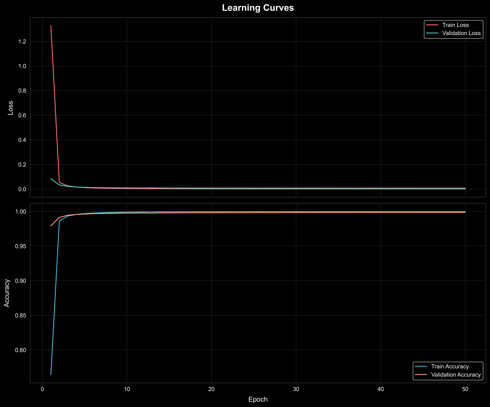
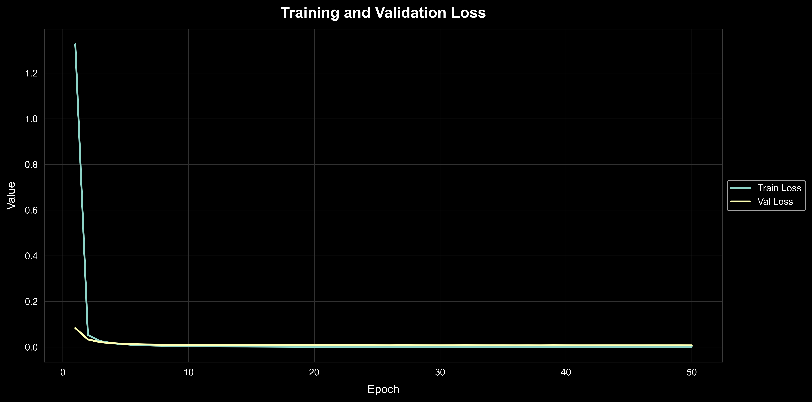
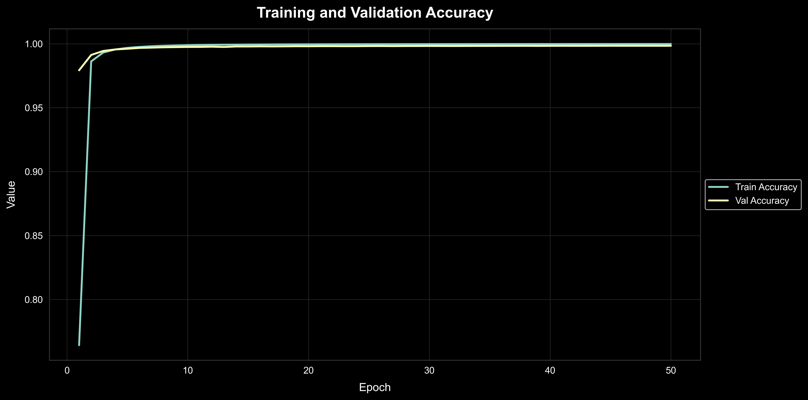
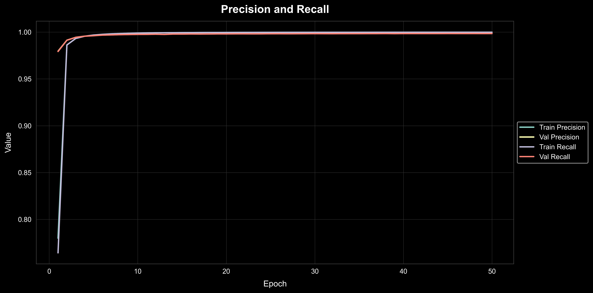

# EfficientNet-KuzushijiKanji

PyTorch implementation of EfficientNet optimized for Kuzushiji-Kanji character recognition, showcasing state-of-the-art performance on historical Japanese text classification.


## Table of Contents
- [Cultural Context](#Cultural-Context)
- [EfficientNet](#EfficientNet)
- [Getting Started](#getting-started)
- [Usage](#usage)
- [Contributing](#contributing)
- [License](#license)


## Cultural Context

Kuzushiji (くずし字), meaning "cursive characters", refers to a style of handwritten Japanese that was widely used from the 8th to the 19th century. This script is characterized by its flowing, interconnected strokes, making it challenging for modern readers to decipher.

### Historical Significance

Kuzushiji was the standard writing style in Japan for over a millennium, used in literature, official documents, and personal correspondence. However, following the Meiji Restoration in 1868, Japan underwent rapid modernization, including reforms in education and writing systems. As a result, Kuzushiji is no longer taught in schools, creating a significant barrier to accessing Japan's rich textual heritage.


### Cultural Impact

The inability to read Kuzushiji has profound implications for Japan's cultural heritage:

- Over 3 million books and a billion historical documents written before 1867 are preserved but largely inaccessible to the general public.
- Even most native Japanese speakers cannot read texts over 150 years old.
- This linguistic gap threatens to disconnect modern Japan from its pre-modern history and culture.

### The Kuzushiji Dataset

To address this challenge, the [National Institute of Japanese Literature (NIJL)](https://www.nijl.ac.jp/) 
and the [Center for Open Data in the Humanities (CODH)](http://codh.rois.ac.jp/) created the Kuzushiji dataset:

- Part of a national project to digitize about 300,000 old Japanese books.
- Contains 3,999 character types and 403,242 characters.
- Released in November 2016 to promote international collaboration and machine learning research.

#### Dataset Variants

1. **Kuzushiji-MNIST**: A drop-in replacement for the MNIST dataset (70,000 28x28 grayscale images, 10 classes).
2. **Kuzushiji-49**: 270,912 28x28 grayscale images, 49 classes (48 Hiragana characters and one iteration mark).
3. **Kuzushiji-Kanji**: 140,426 64x64 grayscale images, 3,832 Kanji character classes.

### Original Research

The Kuzushiji dataset was introduced in the following paper:

```bibtex
@article{clanuwat2018deep,
   title={Deep Learning for Classical Japanese Literature},
   author={Clanuwat, Tarin and Bober-Irizar, Mikel and Kitamoto, Asanobu and Lamb, Alex and Yamamoto, Kazuaki and Ha, David},
   journal={arXiv preprint arXiv:1812.01718},
   year={2018}
}
```
This research aims to engage the machine learning community in the field of classical Japanese literature, 
bridging the gap between cutting-edge technology and cultural heritage preservation. For more information 
on Kuzushiji research, refer to 
the [2nd CODH Seminar: Kuzushiji Challenge](http://codh.rois.ac.jp/kuzushiji-challenge/) and 
the [Kuzushiji Challenge on Kaggle](https://www.kaggle.com/competitions/kuzushiji-recognition).

## EfficientNet

EfficientNet, [introduced by Tan and Le in 2019](https://arxiv.org/abs/1905.11946), is a groundbreaking convolutional 
neural network architecture that achieves state-of-the-art accuracy with an order of 
magnitude fewer parameters and FLOPS than previous models. It uses a compound scaling method that 
uniformly scales network width, depth, and resolution with a set of fixed scaling coefficients.

This project adapts EfficientNet for the challenging task of Kuzushiji-Kanji character 
recognition. Kuzushiji, a cursive writing style used in Japan until the early 20th century, presents 
unique challenges for optical character recognition due to its complex and varied forms.

### EfficientNet Architecture

The EfficientNet architecture is built on mobile inverted bottleneck convolution (MBConv) blocks, which were first introduced in MobileNetV2. The network progressively scales up in width, depth, and resolution across different variants (B0 to B7).

For a detailed view of the EfficientNet architecture, refer to our EfficientNet diagram. 


## Getting Started

To get started with this project, follow these steps:

Clone the repository:

```bash
git clone https://github.com/davidgeorgewilliams/EfficientNet-KuzushijiKanji.git
cd EfficientNet-KuzushijiKanji
```

Install the required dependencies:

```bash
pip install -r requirements.txt
```

## Usage

To use the EfficientNet model in your project, you can utilize the `EfficientNetFactory` class. Here's an example of how to create and use an EfficientNet model:

```python
from efficientnet import EfficientNetFactory
import torch

# Choose the EfficientNet variant you want to use
variant = 'b0'  # Options: 'b0', 'b1', 'b2', 'b3', 'b4', 'b5', 'b6', 'b7'
num_classes = 1000  # Adjust based on your Kuzushiji-Kanji dataset

# Create the specified EfficientNet model
model = EfficientNetFactory.create(variant, num_classes)

# Get the appropriate input size for the chosen variant
input_size = EfficientNetFactory.get_input_size(variant)

# Prepare your input data (example)
input_data = torch.randn(1, 3, input_size, input_size)

# Use the model for inference
with torch.no_grad():
    output = model(input_data)

# Process the output as needed
predicted_class = torch.argmax(output, dim=1)
print(f"Predicted class: {predicted_class.item()}")
```

## Data Preparation and Augmentation

This project uses a combination of Kuzushiji-Kanji and Kuzushiji-49 datasets, which are then balanced and augmented. Follow these steps to prepare your data:

### 1. Download and Extract Datasets

Download the Kuzushiji-49 and Kuzushiji-Kanji datasets from the [ROIS-CODH/kmnist GitHub repository](https://github.com/rois-codh/kmnist). Extract the files into the `EfficientNet-KuzushijiKanji/data` directory. After extraction, your data directory should contain the following files:

```text
data/
├── k49-test-imgs.npz
├── k49-test-labels.npz
├── k49-train-imgs.npz
├── k49-train-labels.npz
├── k49_classmap.csv
├── kkanji.tar
└── kkanji2/
```
### 2. Combine Datasets

Run the script to combine Kuzushiji-Kanji and Kuzushiji-49 datasets:

```bash
python 01_combine_k49_and_kkanji2_datasets.py
```

This script merges:
- Kuzushiji-Kanji: A large, imbalanced 64x64 dataset of 3,832 Kanji characters (140,424 images)
- Kuzushiji-49: 270,912 images spanning 49 classes (extension of Kuzushiji-MNIST)
- Kuzushiji-MNIST: 70,000 28x28 grayscale images across 10 classes (balanced dataset)

### 3. Balance and Augment Dataset

Next, run the script to balance the combined dataset:

```bash
python 02_balance_kuzushiji_dataset.py
```

This script applies various augmentation techniques to create a balanced dataset:
- Elastic transforms
- Affine transforms
- Noise addition

The script generates 10,000 images per Kanji character. For characters with more than 7,000 original samples, it randomly subsamples to maintain diversity.

#### Alternative: Download Pre-balanced Dataset

If you prefer to skip the data preparation steps, you can download our pre-balanced dataset 
from [this Google Drive link](https://drive.google.com/file/d/1JSRjVO2eJspCWxbsrQ8cQth9EuJtjmK5/view?usp=sharing).

### 4. Prepare Kuzushiji Array Data

After balancing the dataset, run the following script to prepare the data for model training:

```bash
python 03_prepare_kuzushiji_array_data.py
```
This script performs several crucial tasks:

1. Create Index Mapping:

   - Generates an index.json file in the ../data/kuzushiji-arrays directory.
   - This JSON file contains a mapping between Kanji characters, their Unicode codepoints, and integer indices.
   - The indices correspond to the output of the classification softmax layer, facilitating sparse categorical cross-entropy loss calculation during training.

2. Generate Numpy Arrays:

   - Creates two numpy arrays saved in the ../data/kuzushiji-arrays directory:
        
        - `images.npy`: Contains all images as uint8 arrays, one image per row.
     
        - `labels.npy`: Contains the corresponding integer labels as uint32 values, with rows matching the images.npy file.

3. Data Organization:

Reads all 10,000 images for each Kanji character from the balanced dataset.
Ensures consistent ordering between images and their corresponding labels.

This preprocessing step is crucial for efficient model training, as it:

- Provides a standardized mapping between characters and their numeric representations.
- Organizes the image data in a format that's ready for batch processing during training.
- Allows for quick loading of the entire dataset into memory, potentially speeding up the training process.

After running this script, you'll have a structured dataset ready for model input, with a clear mapping between the model's output indices and the corresponding Kanji characters and codepoints.

### Note on Script Execution

The scripts in the `src` directory are numbered (e.g., `01_`, `02_`, ...) to indicate the order in which they should be run. Always execute them in ascending numerical order to ensure proper data processing.

## Training Results and Insights

We trained our EfficientNet model on the Kuzushiji dataset using state-of-the-art hardware and optimized training parameters. The training process yielded impressive results, demonstrating the model's ability to learn and generalize effectively on this complex character recognition task.

### Training Environment

- Hardware: 8x NVIDIA H100 (80 GB SXM5) GPUs
- CPU: 208 cores
- RAM: 1.9 TB
- Storage: 24.2 TB SSD
- Provider: LambdaLabs

### Training Parameters

- Batch size: `50000`
- Optimizer: Adam with `amsgrad` setting
- Learning rate: `0.001` (default Adam learning rate)
- Epochs: `50`

We found that using larger batch sizes with the Adam optimizer and its default learning rate resulted in a very stable learning process without experiencing overfitting. Based on our observations, we believe that training for an additional 50 epochs could lead to further incremental improvements without introducing overfitting.

### Results Analysis

#### Learning Curves


The learning curves plot shows the training and validation loss (top) and accuracy (bottom) over the course of training. We observe:
- Rapid initial improvement in both loss and accuracy
- Consistent convergence of training and validation metrics, indicating good generalization
- No signs of overfitting, as validation performance closely tracks training performance

#### Training and Validation Loss


This plot focuses on the loss for both training and validation sets:
- Sharp decrease in loss during the first few epochs
- Gradual and steady decline in loss throughout training
- Close alignment between training and validation loss, suggesting a well-balanced model

#### Training and Validation Accuracy


The accuracy curve demonstrates:
- Rapid increase in accuracy during early epochs
- Consistent high accuracy achieved for both training and validation sets
- Slight edge of training accuracy over validation accuracy, but within acceptable limits

#### Precision and Recall


This plot shows the precision and recall for both training and validation sets:
- High precision and recall values achieved early in training
- Consistent performance across training and validation sets
- Balanced precision and recall, indicating the model's ability to correctly identify characters without sacrificing either metric

#### Top Misclassifications


We analyzed the top 50 misclassified pairs from the validation set at epoch 50:
- Many misclassifications appear intuitive based on the visual similarities between Kanji characters
- Results highlight the need for additional training data to further improve the model's ability to distinguish between visually similar characters
- This analysis provides valuable insights for potential future improvements in data collection and model architecture

### Conclusion

Our EfficientNet model has demonstrated strong performance in Kuzushiji character recognition. The stable learning process and high accuracy achieved suggest that the model has effectively learned to classify a wide range of Kanji characters. However, the analysis of misclassifications indicates that there is still room for improvement, particularly in distinguishing between visually similar characters.

### Model Availability

We have made our trained model available for public use and further research. You can access the following resources via this [Google Drive link](https://drive.google.com/file/d/1UhQ5fkcg8iwKLIHvDBjdEwuYnCEBSV5y/view?usp=sharing):

- Character to index mapping
- Best model checkpoint (epoch 50)

We encourage researchers and enthusiasts to build upon our work and contribute to the ongoing efforts in historical Japanese text recognition.

## Contributing

We welcome contributions to improve EfficientNet-KuzushijiKanji! If you'd like to contribute, please follow these steps:

1. Fork the repository
2. Create your feature branch (`git checkout -b feature/AmazingFeature`)
3. Commit your changes (`git commit -m 'Add some AmazingFeature'`)
4. Push to the branch (`git push origin feature/AmazingFeature`)
5. Open a Pull Request

Please ensure your code adheres to our coding standards and includes appropriate tests.

## License

This project is licensed under the MIT License - see the [LICENSE](LICENSE) file for details.
